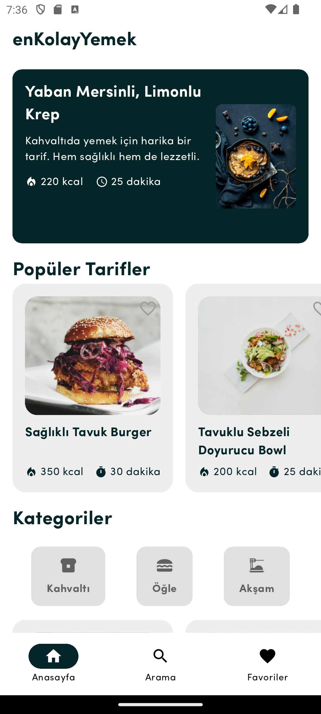
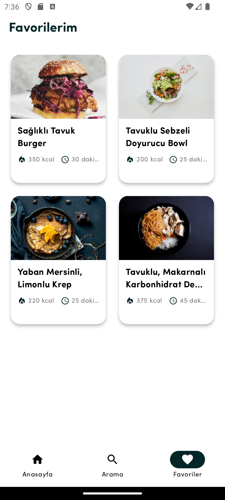
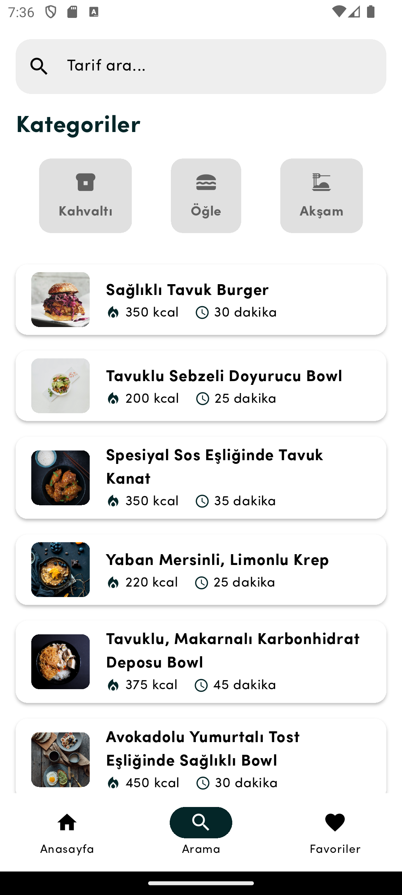

# 🍽️ Recipe App

Recipe App, kullanıcıların farklı kategorilerde yemek tariflerini keşfedebileceği, favorilerine ekleyebileceği ve arayabileceği bir mobil uygulamadır. 

## 📸 Ekran Görüntüleri

### Ana Sayfa


### Favorilerim


### Arama Sayfası


## 🚀 Özellikler
- 📌 Yemek tariflerini listeleme
- 🔍 Tarifleri kategoriye veya isme göre arama
- ❤️ Tarifleri favorilere ekleme (Hive kullanılarak)
- 🍽️ Sabah, öğle, akşam yemek tarifleri kategorileri
- 📱 Şık ve kullanıcı dostu tasarım (Figma esinlenmesi)

## 🛠️ Kullanılan Teknolojiler
- **Flutter** - Mobil uygulama geliştirme
- **Provider** - State yönetimi
- **Hive** - Lokal veri saklama (Favorilere ekleme için)
- **View-ViewModel-Model** - MVVM mimarisi

## 📦 Proje Mimarisi
Proje MVVM (Model-View-ViewModel) mimarisi ile geliştirilmiştir:
- **Model** → Veri yapıları ve iş mantığı
- **ViewModel** → İş mantığını yöneten katman
- **View** → Kullanıcı arayüzü

## 🏗️ Kurulum
Projeyi çalıştırmak için aşağıdaki adımları takip edebilirsin:

```sh
git clone https://github.com/emirhan-coban/recipe_app.git
cd recipe_app
flutter pub get
flutter run
```

## 🤝 Katkıda Bulunma
Eğer projeye katkıda bulunmak istiyorsan, şu adımları takip edebilirsin:

1. Bu repoyu **fork** et
2. Yeni bir özellik ekle
3. PR (Pull Request) oluştur

## 📬 İletişim
Projeyle ilgili herhangi bir sorunun varsa benimle iletişime geçebilirsin:

📧 [emirhan@example.com](mailto:emirhan@example.com)  
🐦 [GitHub Profilim](https://github.com/emirhan-coban)
